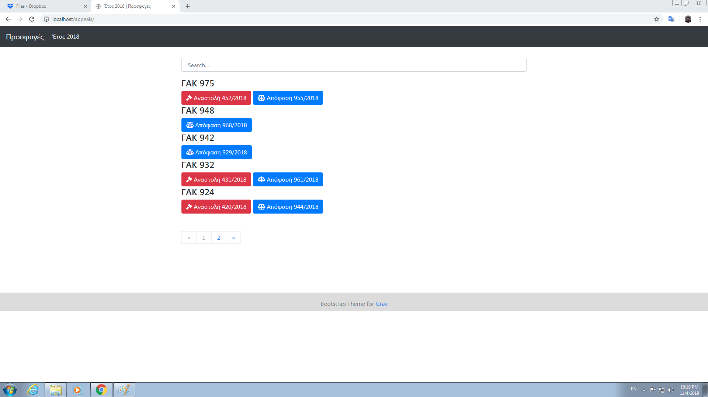
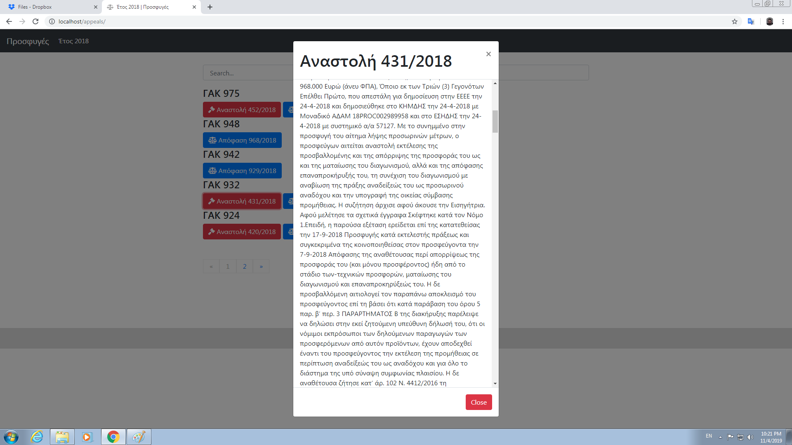
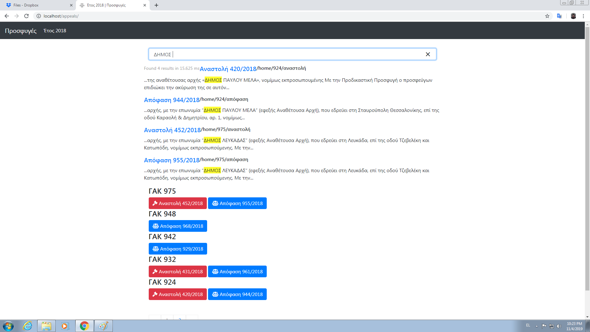

										 Pre-judicial appeals Blog
										
A Web blog where the user is able to get valuable information about several pre-judicial appeals according to their identification number (ΓΑΚ). Each pre-judicial appeal is consisted of its suspended judgement and judgement, where both of them are accessible via the appropriate buttons. A search bar is added into this blog in order to find results for both suspended judgements and judgements via keywords regarding these pre-judicial appeals.

This app has been made via [Bootstrap](https://getbootstrap.com/), [font awesome icons](https://fontawesome.com/), [markdown](https://www.markdownguide.org/) and [GravCMS](https://getgrav.org/).

**General view**

**Specific view**

**Search results**

